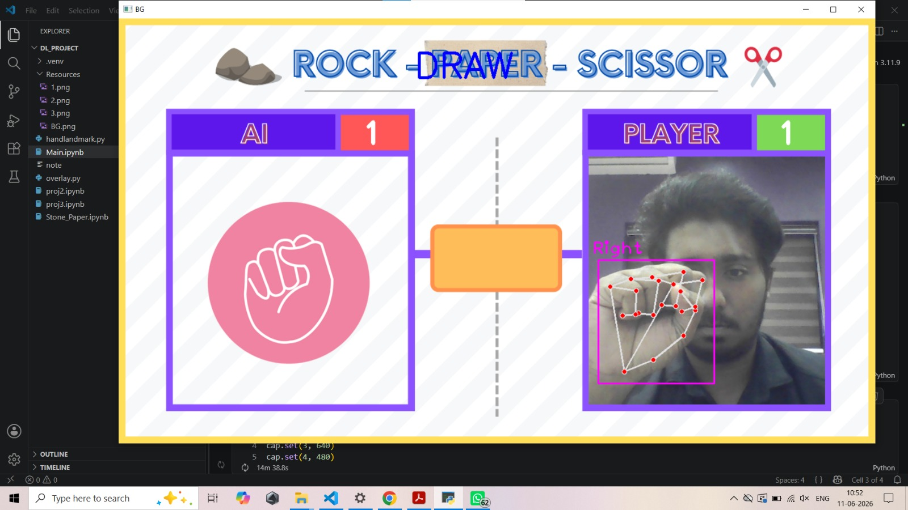

# 🎮 AI-Based Hand Gesture Recognition Game

A real-time **AI-powered Hand Gesture Recognition Game** built using **Python, OpenCV, MediaPipe, and CVZone**. This project uses **Computer Vision** to detect and classify hand gestures (Rock, Paper, Scissors) in real time and enables interactive gameplay with audio feedback.

---

## 🚀 Features

✅ Real-time hand gesture detection  
✅ Rock, Paper, Scissors gesture classification  
✅ Computer vision-based hand tracking  
✅ AI-powered gesture recognition system  
✅ Real-time gameplay interaction  
✅ Audio feedback using Text-to-Speech (TTS)  
✅ Optimized for smooth performance and low latency  

---

## 🛠️ Tech Stack

- **Programming Language:** Python  
- **Computer Vision:** OpenCV  
- **Hand Tracking:** MediaPipe, CVZone  
- **Audio Feedback:** Text-to-Speech (TTS)  
- **Deep Learning / AI:** Gesture Recognition  

---

## 📌 Project Workflow

1. Capture live webcam feed  
2. Detect hand landmarks using **MediaPipe**  
3. Recognize hand gestures  
4. Classify gesture into:
   - ✊ Rock
   - ✋ Paper
   - ✌️ Scissors
5. Compare user gesture with system-generated move  
6. Display game result with audio feedback

---

## 📸 Project Screenshots

### Main Interface


### Game Win Screen


### Draw Result


### Invalid Move Detection


### Code Window


### Player Win


## 📂 Project Structure

```bash
AI-Hand-Gesture-Recognition-Game/
│── dataset/              # Gesture images dataset
│── model/                # Trained model files (.h5)
│── assets/               # Images, sounds, UI assets
│── main.py               # Main application file
│── requirements.txt      # Dependencies
│── README.md             # Documentation
